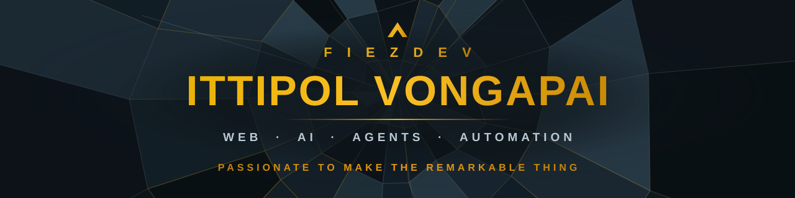

<!--
  FiezDev — GitHub profile README.
  Structure (do not reorder): Banner -> Intro+Motto -> Selected Work -> Tech Stack -> Connect.
  Banner is a self-contained SVG (assets/banner.svg) — renders identically on light & dark.
  Identity + work only (no job-title/seniority framing). Only public repos are linked.
  NOTE: badge groups are kept on a single line each so they flow horizontally regardless of
  GitHub's soft/hard line-break handling.
-->

 

**Hi, I'm Ittipol — also known as Fiez.** 👋

I build across <b>web, AI, and automation</b> — multi-agent AI systems, content-automation platforms, and the side projects I can't stop tinkering with. I like turning messy real-world problems into things that <b>ship, run, and last</b>. Self-taught, relentlessly curious, and powered by a steady diet of ramen and juice.

<i>“Passionate to make the remarkable thing.”</i> &nbsp;·&nbsp; 3,800+ verified contributions across 2025–26

 

## ⛰ Selected Work

<table>
<tr>

<td width="50%" valign="top">
<h3>🤖 AtEase — AI Content Automation</h3>

A visual node-graph workflow builder that turns one idea into multi-platform
posts — multi-agent execution, human-approval gates, and auto-publishing.
Running in production behind a live AI-news page.

<b>In production · multi-agent pipeline · per-step approval gates</b>

<code>TypeScript</code> <code>React</code> <code>Bun</code> <code>LLMs</code> <code>Playwright</code>

</td>

<td width="50%" valign="top">
<h3>🧰 ORG-TOOLS — Engineering Docs Platform</h3>

Turns Jira projects into versioned ISO documentation — architecture diagrams,
screenshots, and exportable Word docs — with pgvector semantic search and
zero-knowledge credential vaults.

<b>Jira → versioned ISO docs · pgvector search · zero-knowledge vaults</b>

<code>TypeScript</code> <code>Bun</code> <code>React</code> <code>PostgreSQL</code>

</td>

</tr>
<tr>

<td width="50%" valign="top">
<h3>📥 QuadOne — AI Inbox Triage</h3>

AI inbox triage for solo knowledge workers — turning a noisy inbox into a
prioritized, actionable queue so the important things surface first.

<b>Solo build · LLM-powered triage &amp; prioritization</b>

<code>TypeScript</code> <code>Next.js</code> <code>LLMs</code>

</td>

<td width="50%" valign="top">
<h3>🛠️ git-doc — Git Work Summarizer</h3>

A tool that summarizes your yearly git work across multiple repositories,
generating Excel reports with AI-powered summaries.

<b>Multi-repo · AI-summarized · Excel export</b>

<code>TypeScript</code> <code>Node.js</code> <code>LLMs</code>

</td>

</tr>
</table>

 

## 🛠 Tech Stack

**Languages** 
      

**Frontend** 
     

**Backend** 
    

**AI / ML** 
    

**Data / Infra** 
        

 

## ✉ Connect

   

Open to interesting work, collaborations, and a good conversation about building things.

